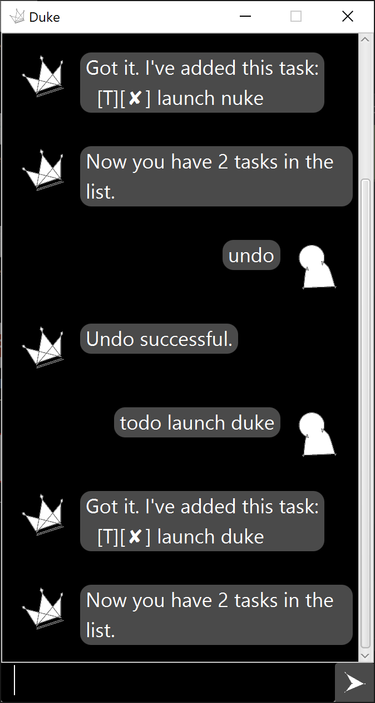

# User Guide
 <br>
Duke is a task-management application with a graphical user interface that uses a command-line input to simulate conversing with a chat bot. It is made with a project template provided by CS2103/T AY2021S1.

## Quick Start
1. Ensure that you have Java `11` or above installed on your computer.
2. Download the latest `Duke.jar` [here](https://github.com/jflim98/ip/releases).
3. Copy `Duke.jar` to the folder you want to use as the home folder for Duke.
4. Double-click `Duke.jar` to launch Duke.
5. A list of commands can be found [here](#command-summary). A more comprehensive usage guide can be found [here](#usage).

## Features 

### Add tasks
Duke supports the creation of three different types of tasks: [`todo`](#todo---adding-a-todo), [`deadline`](#deadline---adding-a-deadline) and [`event`](#event---adding-a-event). `todo` allows the user to give a description to the task while `deadline` and `event` allows the user to specify a date in which the task must be completed by or at respectively.

### List tasks
Duke is able to [`list`](#list---listing-all-tasks) the tasks the user has added. Duke displays the type of the task, description of the task and status of the task.

### Mark task as done
Duke allows the user to mark a task as [`done`](done-marking-a-task-as-done) once the user has completed the task.

### Delete tasks
Duke is able to [`delete`](delete---deleting-a-task) tasks that has already been added.


### Find tasks
Duke can [`find`](find---finding-a-task) tasks that include a certain string in its description and list them for easy access.

### Undo last command
Duke can [`undo`](undo---undoing-previous-command) the last command that made a change to the task list.


## Usage

#### Command Format
Words in `UPPER_CASE` are parameters that should be provided by the user. All parameters are compulsory.

### `todo` - Adding a ToDo

Adds a ToDo task to the task list.

Format:
`todo DESCRIPTION`

Example of usage: 

* Command:
`todo tutorial`

Expected outcome:
```
Got it. I've added this task:
  [T][✗] tutorial
```

### `deadline` - Adding a Deadline

Adds a Deadline task to the task list.

Format:
`deadline DESCRIPTION /by YYYY-MM-DD`

Example of usage: 

* Command:
`deadline submit assignment /by 2020-09-16`

Expected outcome:
```
Got it. I've added this task:
  [D][✗] submit assignment (by: Sep 16 2020)
```

### `event` - Adding a Event

Adds a Event task to the task list.

Format:
`event DESCRIPTION /at YYYY-MM-DD`

Example of usage: 

* Command:
`event finals /at 2020-12-02`

Expected outcome:
```
Got it. I've added this task:
  [E][✗] finals (at: Dec 02 2020)
```

### `list` - Listing all tasks

Lists all tasks with their respective indexes currently in the task list.

Format:
`list`

Example of usage: 

* Commands used previously:
`todo tutorial`
`deadline submit assignment /by 2020-09-16`
`event finals /at 2020-12-02`
* Command:
`list`

Expected outcome:
```
1. [T][✗] tutorial
2. [D][✗] submit assignment (by: Sep 16 2020)
3. [E][✗] finals (at: Dec 02 2020)
```

### `done` - Marking a task as done

Marks a task as done. Best used after `list` to get the indexes of tasks.

Format:
`done INDEX`

Example of usage: 

* Commands used previously:
`todo tutorial`
`deadline submit assignment /by 2020-09-16`
`event finals /at 2020-12-02`
* Command:
`done 1`

Expected outcome:
```
Nice! I've marked this task as done:
  [T][✓] tutorial
```

### `delete` - Deleting a task

Deletes a task from the task list. The rest of the tasks after the deleted tasks will have their indexes shifted up by one. Best used after `list` to get the indexes of tasks.

Format:
`delete INDEX`

Example of usage: 

* Commands used previously:
`todo tutorial`
`deadline submit assignment /by 2020-09-16`
`event finals /at 2020-12-02`
`done 1`
* Command:
`delete 1`

Expected outcome:
```
Noted. I've removed this task:
  [T][✓] tutorial
```

### `find` - Finding a task

Finds tasks whose description contain the keyword provided. The indexes of the tasks found correspond to their actual index i.e. the indexes provided in `list`.

Format:
`find KEYWORD`

Example of usage: 

* Commands used previously:
`todo tutorial`
`deadline submit assignment /by 2020-09-16`
`event finals /at 2020-12-02`
`done 1`
`delete 1`
* Command:
`find finals`

Expected outcome:
```
Here are the matching tasks in your list:
2. [E][✗] finals (at: Dec 02 2020)
```

### `undo` - Undoing previous command

Reverts the task list to the last state that made changes to the task list i.e. `todo` `deadline` `event` `done` `delete`.  All subsequent `undo` commands continues to revert the state up to a maximum of four times. The first change made to the task list after running the application for the first time cannot be undone.

Format:
`undo`

Example of usage:

* Commands used previously:
`todo tutorial`
`deadline submit assignment /by 2020-09-16`
`event finals /at 2020-12-02`
`done 1`
`delete 1`
`undo`
* Command:
`list`

Expected outcome:
```
1. [T][✓] tutorial
2. [D][✗] submit assignment (by: Sep 16 2020)
3. [E][✗] finals (at: Dec 02 2020)
```

## FAQ
**Q**: How do I transfer duke to another computer?
**A**: Copy the folder `duke.jar` is in to the other computer. Alternatively, just copying `duke.jar` and the folder `data` is enough.

## Command Summary
`todo DESCRIPTION`
`deadline DESCRIPTION /by YYYY-MM-DD`
`event DESCRIPTION /at YYYY-MM-DD`
`list`
`done INDEX`
`delete INDEX`
`find KEYWORD`
`undo`
